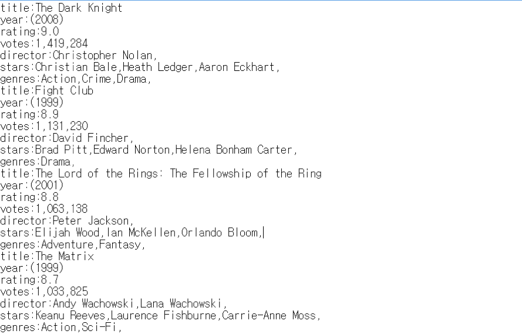
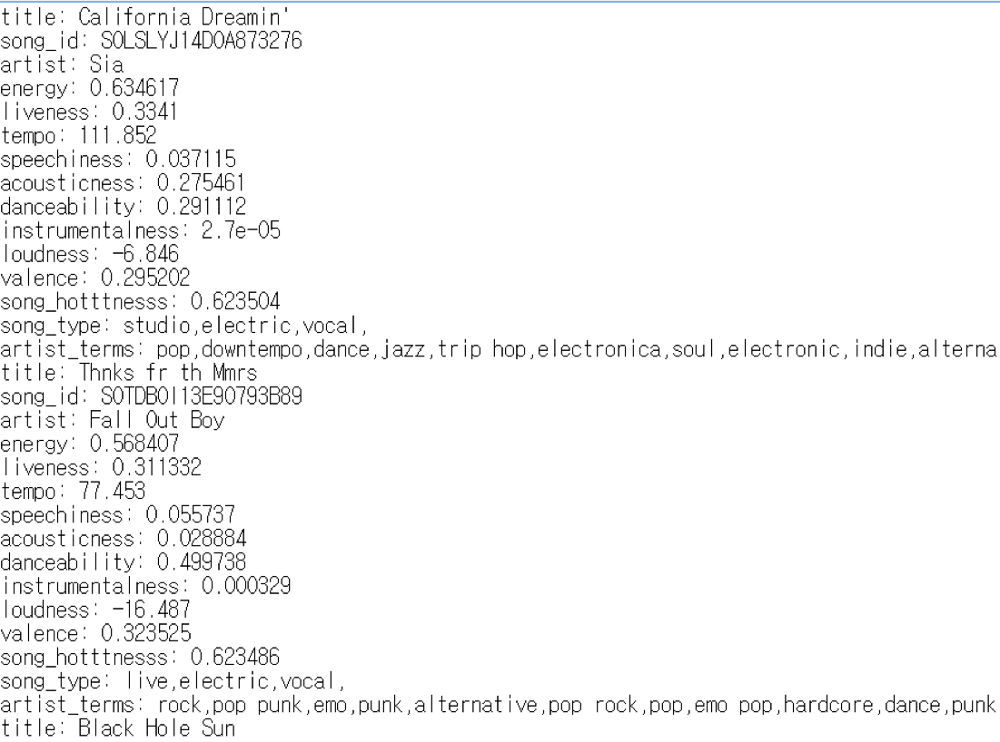
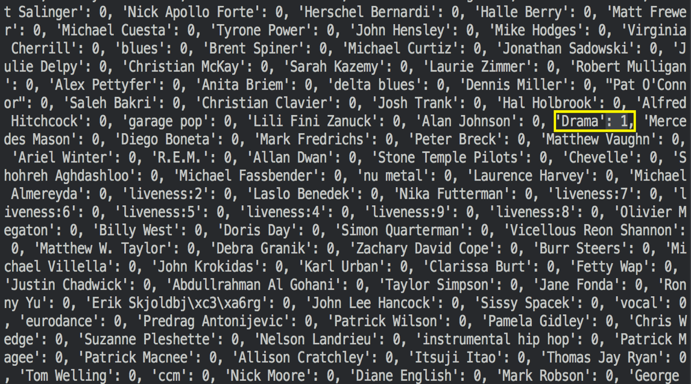
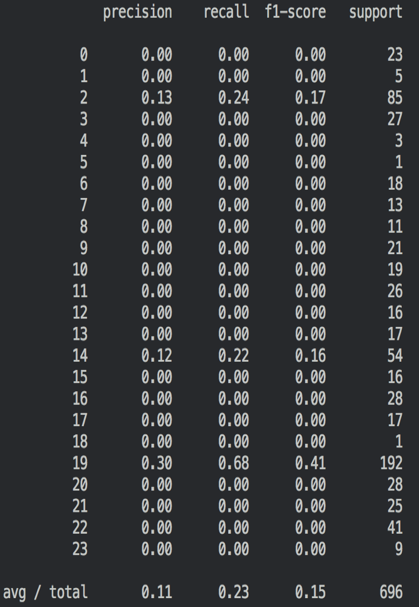

Preference Shooting(취향저격프로젝트)
===================
사람의 취향은 선호하는 예술작품을 통해 드러날 수 있다. 어떤 것이 아름답다고 느끼고 끌리는지는 작품의 선호도를 통해 드러나고, 이러한 취향은 브랜드를 선택하는 데 영향을 미칠 것이라고 생각했다. 따라서, 본 프로젝트에서는 작품의 선호도와 브랜드 선호도를 분석하여 둘의 상관관계를 파악하고,이 정보를 통해 회사들은 자신의 브랜드를 좋아하는 사람들에 맞춘 마케팅 전략을 세울 수 있다.

  프로젝트에 대한 설명은 아래 YouTube에서 간단하게 확인할 수 있다.
  <a href="https://www.youtube.com/watch?v=rPOJF1KttCI"></img></a>  

#### Implementation
- Language: Python 2.7
- Tool: ipython notebook, visual studio code, sublime text
- Version control tool: Github
- Database: IMDB(6099 movies), Apparel search(342 brands)
- API: Instagram API, The Echo nest(3256 musics)
- Data Learning model: [SVM](http://scikit-learn.org/stable/modules/svm.html)

### Process
   [1. Construct Movie DB, Music DB, and Brand DB](#1-construct-movie-db-music-db-and-brand-db)
 
   [2. Search Instagram user ID including movie tags](#2-search-instagram-user-id-including-movie-tags)
 
   [3. Search brand name and music tags for each user id](#3-search-brand-name-and-music-tags-for-each-user-id)
 
   [4. Train the data with SVM model](#4-train-the-data-with-svm-model)
 
   [5. Make application to evaluate the model](#5-make-application)
 
   [6. Result](#6-result)

****
## 1. Construct Movie DB, Music DB, and Brand DB
우리는 영화와 음악 그리고 브랜드 데이터를 수집하였다. 
영화는 [iMDB](http://www.imdb.com/)에서 1992년부터 2014년까지의 영화 68,316개를 직접 crawling하였고, 각 영화마다 7개의 feature(장르, 감독, 평점, 평점개수, 제목, 출연자, 연도)를 모았다.
우리가 원하는 음악 데이터를 모으기 위해 여러 사이트와 api를 찾아다닌 결과, [The Echo Nest](http://static.echonest.com/enspex/)에서는 꽤나 큰 음악 database를 가지고 있었고, 그 중 우리가 필요로 했던 여러 feature 정보도 포함하고 있었다. 본 프로젝트에서는 The Echo Nest api를 통해 음악 제목, id, 아티스트, enery, liveness, tempo, speechiness, acousticness, danceability, instrumentalness, loudness, valeance, song hotttness, song type, artist terms 정보를 포함한 음악 3,256개를 모았다.
마지막으로 apparel search 웹사이트를 통해 342개의 apparel brand 리스트를 얻었다.

> Movie/parser.py -> iMDB 사이트를 파싱하여 Movie_DB.txt를 만든다.

> Music/get_music_data.py -> echo nest api를 이용해 Music_DB.txt를 만든다.

> Brand/brandlist.py -> brand_DB.txt를 만든다.

아래 screenshot은 우리가 모은 영화와 음악 데이터셋의 일부이다.

 </img> </img>

## 2. Search Instagram user ID including movie or music tags
우리는 어떤 한 사람이 좋아하는 영화나 음악 정보를 가지고 그 사람이 선호할만한 브랜드를 추천해줄 것이다. 
그러기 위해서는 training set를 만들어야 하는데, 우리는 instagram의 해시태그 정보를 활용하였다.
구현 과정을 설명하면, 우리가 모은 movieDB에 있는 영화 제목으로 인스타그램 태그를 검색하여 가장 많은 게시글이 달린 태그를 받아와 그 태그가 달린 게시글을 쓴 유저들을 받아온다. 
이 때 영화제목으로 가능한 검색 조합을 생성하여 검색한다. 

> 예를 들어 영화제목이 "Harry Potter and the Deathly Hallows: Part 2" 라면, 
>  >생성 가능한 검색어는 "harry potter", "harry potter and the deathly hallows", "the deathly hallows", "Harry Potter and the Deathly Hallows: Part 2" 등이 될 수 있다.

이렇게 검색한 영화들로 이 영화를 태그한 사용자 정보를 모아 /instagram/user_movie_DB.txt로 만들었다.

## 3. Search brand name and music tags for each user id
이제 이 유저들이 올린 모든 게시글을 탐색하면서 태그된 음악과 브랜드를 모두 찾아낸다. 이때, 태그를 검색해야 하는데, 매번 검색하기 번거로워서 검색 가능한 태그를 모두 뽑아 놓는데, 그게 tag_search.py이고, 여기서 만들어지는 태그들은 music_tag.txt, brand_tag.txt로 만들어진다.

## 4. Train the data with SVM model
이 과정이 모두 끝나면 training.txt가 만들어지는데, 여기 들어간 자료는 어떤 사용자가 태그를 건 영화들과 음악들, 그리고 브랜드가 들어간다. 

> 즉, 트레이닝 데이터에서 x 벡터가 영화와 음악이 되고, y가 브랜드가 된다.

여기서 생긴 문제점은, 사람마다 태그가 달린 영화와 음악 개수가 다르므로, x벡터가 가변길이가 된다. 따라서 우리는 모든 feature를 포함한 약 9,000 이상의 dimension을 가지는 벡터를 만들었다. 이 feature란, 영화의 감독, 장르, 배우, rating, vote와 음악의 여러 정보를 말한다. 

> 예를 들어, 사용자가 harry potter를 봤다면 간단히 말해 벡터에서 david yates, daniel radcliffe, adventure에 해당하는 위치만 1이되고 나머지가 0이 되는 형식이 된다.

 </img>

그리고 y 벡터는 모든 브랜드가 있고 그 중 하나만 1이고, 나머지는 모두 0인 벡터가 된다. 이 벡터를 만드는 과정은 data_vector.py에서 확인할 수 있고, 결과는 x.p, y.p파일이다.
이제 러닝모델에 만든 벡터파일을 넣고 학습시키면 되는데 우리는 **SVM**을 사용하였고, 파라미터는 **grid search**를 통해 결정했다. 이 결과 만들어지는 모델을 SVM.pkl로 저장하였다.이 과정은 train.py에서 확인할 수 있다.

## 5. Make application
학습된 모델의 성능을 평가하기 위해 우리는 인스타그램 username을 입력하면, 그 유저의 게시글을 분석해 vector로 만들고, 학습된 모델에 넣어 해당 사람이 좋아할만한 브랜드를 출력하는 프로그램을 구현하였다. 

이 어플리케이션은 우리가 만든 시스템이 실제로 작동한다는 것을 보여주기 위한 하나의 예일 뿐이다. 

우리는 궁극적으로 이 시스템을 브랜드 회사에서 이용하여 자신의 브랜드를 사용하는 사람들이 어떤 영화나 음악을 좋아하는 지 알게되면 그에 맞춰 마케팅 전략을 더욱 효율적으로 짤 수 있기를 바란다.

## 6. Result
instagram을 통해 유저 데이터를 얻는데 시간이 너무 오래걸려 데이터를 많이 뽑아내지 못했다. 950개정도의 training set으로 얻은 f1-score은 0.12정도로 낮지만, training set만 충분히 구축된다면 더 나은 성능을 기대해 볼 수 있다.

 </img>

